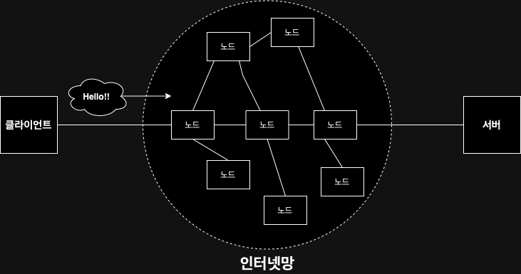
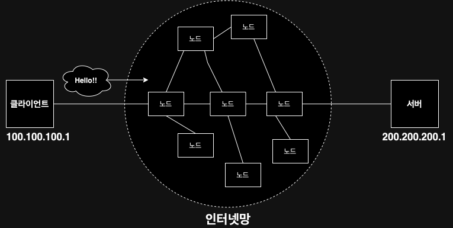
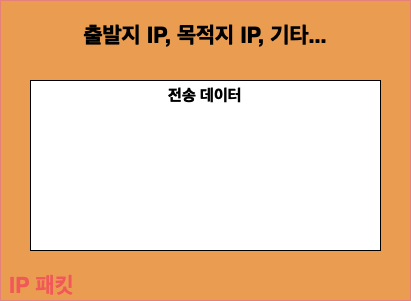
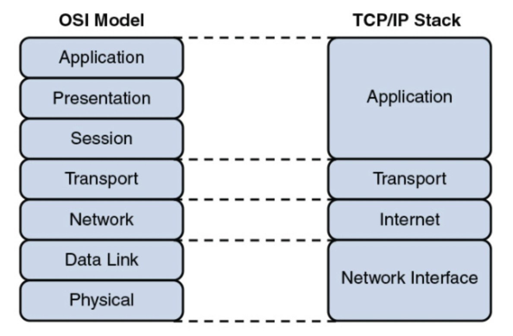
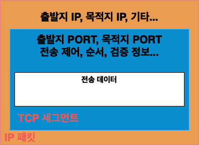
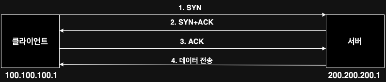
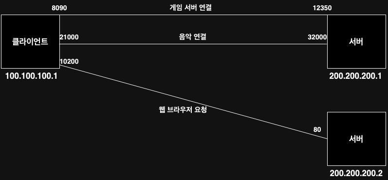

# Internet Network

## 1. 인터넷 통신
  

- 인터넷 상에서는 컴퓨터 2대가 어떻게 통신을 할까?
  - 클라이언트가 요청을 하면 서버가 응답을 해준다.
  - 요청과 응답을 하기 위해 그 중간에 인터넷이라는게 존재한다.
  - 인터넷망은 수많은 노드로 이루어져 있으며, 그 노드를 거쳐 통신을 한다.
---

## 2. IP(Internet Protocol)
- 복잡한 인터넷망, 수 많은 노드를 통해 넘어가는데 어떻게 넘어가는지 알기 위해서는 IP를 알아야한다.
- 클라이언트와 서버 모두 IP 주소를 부여 받아야 한다.
- **IP의 역할**
  - 지정한 IP 주소에 데이터 전달
  - 패킷이라는 통신 단위로 데이터 전달
  
   

  

- **IP 패킷 정보**
  - 출발지 IP, 목적지 IP, 전송 데이터, 기타 등등을 담고있다.

- **클라이언트 패킷 전달** 
  - 클라이언트 IP와 서버 IP, 전송 데이터를 담고 인터넷망으로 던져진다. 
  - 각각 노드끼리 패킷을 던지면서 최종 목적지에 도달한다.

- **서버 패킷 전달**
  - 다시 클라이언트에게 OK라는 메세지를 담고 전달한다. 과정은 클라이언트 패킷 전달하는 과정과 동일하다.
  - 요청할 때와 다시 돌려줄 때의 노드 경로는 다를 수 있다.

- **IP 프르토콜의 한계**
  - 비연결성 : 패킷을 받을 대상이 없거나 서비스 불능 상태여도 패킷을 전송함
  - 비신뢰성 : 중간에 패킷이 사라지거나, 순서대로 안올 수 있음
  - 프로그램 구분 불가능 : 같은 IP를 사용하는 서버에서 통신하는 애플리케이션이 둘 이상이면 구분할 수 없음
---

## 3. TCP, UDP
  

- **인터넷 프로토콜 스택의 4계층**
  - 프로그램이 'Hello! World!' 메시지 생성(애플리케이션 계층)
  - SOCKET 라이브러리를 통해 전달(애플리케이션 계층)
  - TCP 정보 생성, 메시지 데이터 포함(전송 계층)
  - IP 패킷 생성, TCP 데이터 포함(전송 계층)
  - LAN 카드 -> 인터넷 -> 서버(네트워크 인터페이스 계층)

- **TCP/IP 패킷 정보**

- **TCP 특징**
  - TCP는 Transmission Control Protocol의 약자로 전송 제어 프로토콜을 의미한다.
  - 특징
  - **연결 지향(TCP 3 way handshake)**
    - TCP 3 way handshake란?
      - SYN : 접속 요청
      - ACK : 요청 수랑

      

  - **데이터 전달 보증**
    - 클라이언트가 데이터 전송을 하면 서버가 데이터 잘 받았다고 응답을 한다.
  - **순서 보장**
    - 패킷1, 패킷2, 패킷3 순서로 전송을 했는데 패킷1,패킷3,패킷2 순서로 도착을 하면 서버가 패킷2부터 다시 보내라고 요청을한다.

- **UDP 특징**
  - 하얀 도화지와 같음(기능이 거의 없음)
  - 연결 지향, 데이터 전달 보증, 순서 보장을 하지 않음
  - 하지만! 단순하고 빠르다.
  - 즉, IP와 거의 같지만 PORT와 체크섬 정도만 추가 된 것
  - TCP는 의미 정의가 되어있지만, UDPsms 애플리케이션 단에서 추가 작업을 할 수 있다. 
---

## 4. PORT

- 하나의 IP에 여러 개의 애플리케이션이 연결되어 있다. 이 때는 어떻게 구분하고 있을까?
  - PORT는 같은 IP 안에서 구분을 하는 구분 값이다.
  - 쉽게 정리하면 IP가 LG빌리지 아파트 이고, PORT가 202동 901호와 같은 동호수를 의미한다.
- 0 ~ 65545 할당이 가능
  - 0 ~ 1023 : 잘 알려진 포트로 사용하지 않는 것이 좋다.
    - FTP : 20, 21
    - TELNET : 23
    - HTTP : 80
    - HTTPS : 443
---

## 5. DNS
- Domain Name System의 약자로 전화번호부와 같은 역할을 한다고 보면된다.
  - IP는 기억하기 어렵고 변경이 될 수 있다.
  - 도메인 명을 IP 주소로 변환해준다.
- 즉, DNS 서버에서 도메인명과 그에 응하는 IP 주소를 가지고 있다.
  - 클라이언트가 google.com 이라는 도메인 요청
  - DNS 서버에서 google.com에 응하는 IP 주소 300.300.300.3을 반환
  - 300.300.300.3으로 접속
---

## 정리
- 인터넷 통신을 하기 위해선 IP가 필요하다.
- IP는 신뢰성, 순서 보장 등 문제가 있어서 이 문제를 해결하기 위해 TCP, UDP를 사용한다.
- 같은 IP 안에서 여러 동작을 구분하기 위해 PORT를 사용한다.(IP는 아파트, PORT는 몇동몇호라고 생각하자)
- DNS는 IP는 변하기 쉽고 외우기 어려운 것을 해결하기 위해 사용한다.

