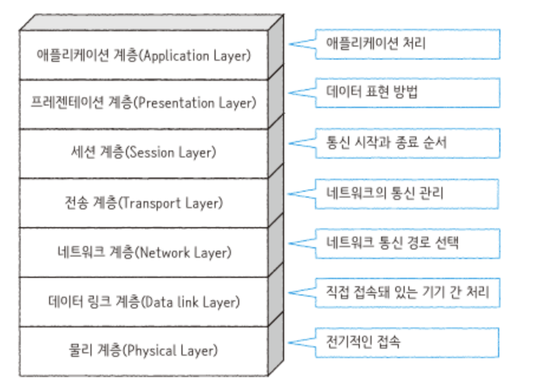

# OSI 7 Layer

### 1. OSI 7 Layer란?
- 국제 표준화 기구(ISO)에서 정의한 네트워크 표준 모델로, 네트워크에서 통신이 일어나는 과정을 7단계로 나눈 것을 말한다.
---

### 2. OSI 7 Layer 구조 그림
  

---

### 3. OSI 7 Layer의 각 계층에 대한 설명
- 참고 내용 :
  - 물리 계층은 하드웨어, 데이터 링크 계층은 하드웨어 + 소프트웨어, 3계층부터는 다 소프트웨어이다.
  - 프로토콜 : 통신을 위한 형태 또는 규약
  - MAC 주소 : 랜카드당 하나의 MAC 주소가 존재, 주소 값이 변하지 않는다.
  - IP 주소 : 컴퓨터당 하나의 주소가 부여되지만, 중간에 변할 수 있다. 
---

- **1계층 - 물리 계층(Physical Layer)**
    - 주로 전기적, 기계적, 기능적인 특성을 이용해서 통신 케이블로 데이터를 전송하게 된다. 즉, 신호를 만드는 역할을 한다. 단순히 데이터를 전달만 할 뿐 전송하거나 받는 데이터가 무엇인지, 에러가 있는지 등에는 전혀 신경쓰지 않는다.
    - Modem, Cable, Fiber, RS-232C 프로토콜이 있다.
    - 통신 단위 : bit
    - 대표 장비 : 통신 케이블, 리피터, 허브 등

- **2계층 - 데이터 링크 계층(Data Link Layer)**
    - 1계층인 물리 계층을 통해 송수신되는 정보의 오류와 흐름을 관리하여 안전한 정보의 전달을 수행할 수 있도록 도와준다.
    - 데이터 링크 계층은 맥 주소를 가지고 통신한다. 즉, 프레임에 물리적 주소(Mac Address)를 부여하고 에러 검출, 재전송, 흐름제어를 수행
    - 이더넷, MAC, PPP, ATM, LAN, Wifi 프로토콜이 있다.
    - 전송 단위 : Frame
    - 대표 장비 : 브릿지, 스위치, 이더넷

- **3계층 - 네트워크 계층(Network Layer)**
    - 네트워크 계층은 장비를 통해(라우터) 경로를 선택하고 주소(IP)를 정한 뒤, 경로에 따라 패킷을 전달해 주는 역할을 한다. IP, ICMP 등 프로토콜이 있다.
    - 전송 단위 : Packet
    - 대표 장비 : 라우터, L3 스위치

- **4계층 - 전송 계층(Transport Layer)**
    - 전송 계층에서는 신뢰성 있는 데이터를 전송하고, 전송 속도를 조절하며, 오류가 발생된 부분은 다시 맞춰 주는 계층이다.
    - 데이터 전송을 하기 위해서 Port 번호를 사용하는데 대표적으로는 TCP와 UDP 프로토콜이 있다. 보통은 TCP를 사용!
    - TCP는 신뢰성, 연결지향적 특징을 가지고 있으며, UDP는 비신뢰성, 비연결성, 실시간이라는 특징을 가지고 있다.
    - 전송 단위 : Segment

- **5계층 - 세션 계층(Session Layer)**
    - 세션 계층은 네트워크상 양쪽 연결을 관리하고 연결을 지속 시켜주는 계층이다. 주로 TCP/IP 세션을 만들고 유지하며, 세션이 종료되거나 전송이 중단될 시 복구하는 기능이 있다. 통신 장치 간 상호작용 및 동기화를 제공한다.
    - NetBIOS, SSH, TLS 프로토콜이 있다.
    - 전송 단위 : Data OR Meggage

- **6계층 - 표현 계층(Presentation Layer)**
    - 표현 계층은 코드 간의 번역을 담당하여 사용자 시스템에서 데이터의 형식 상 차이를 다루는 부담을 응용 계층으로 부터 덜어준다. 즉, 데이터의 표현 방식을 결정하는 계층이다.
    - 파일 인코딩/디코딩, 명령어 포장, 압축/해제, 암호화/복호화를 통해 수신자가 이해할 수 있도록 데이터를 표현한다. JPG, MPEG, SMB, AFP 프로토콜이 있다.
    - 전송 단위 : Data

- **7계층 - 응용 계층(Application Layer)**
    - 응용 계층은 사용자 또는 애플리케이션이 네트워크에 접근할 수 있도록 해준다. 사용자를 위한 인터페이스를 제공하며, 사용자에게 보이는 유일한 계층이다.
    - 메일 전송, 인터넷 접속 등의 작업을 수행할 수 있다. 해당 계층은 최종 목적지로서 HTTP, FTP, SMTP, POP3, Telnet 등과 같은 프로토콜이 있다.
    - 전송 단위 : Data
---

### 4.TCP/IP 4 Layer란?
- OSI 7 Layer 모델은 네트워크 통신 표준화를 위한 개념 모델이다. 즉, 실제로 인터넷 통신이 이렇게 동작하지는 않고, 이렇게 계층을 나누어 통신하도록 설계하자는 국제 표준화기구의 제안이라고 생각하면 된다.
- 현재 수많은 프로그램들이 인터넷으로 통신하는데 있어 가장 기반이 되는 프로토콜로 실제 대다수 프로그램은 TCP와 IP로 통신하고 있다.
---

### 5. TCP/IP 4 Layer 구조 그림
  

---

### 6. TCP/IP 4 Layer의 각 계층에 대한 설명
- **1계층 - 네트워크 액세스 계층(Network Access Layer)**
    - OSI 7 계층의 물리 계층과 데이터 링크에 해당한다.
    - 네트워크 통신의 물리적인 부분들을 주로 포함한다. (물리적인 주소로 MAC 사용)

- **2계층 - 인터넷 계층(Internet Layer)**
    - OSI 7 계층의 네트워크 계층에 해당한다.
    - 컴퓨터 간 라우팅을 담당, 어드레싱, 패키징 기능을 제공한다.
    - 네트워크상 최종 목적지까지 정확하게 연결되도록 연결성을 제공한다.

- **3계층 - 전송 계층(Transport Layer)**
    - OSI 7 계층의 전송 계층에 해당한다.
    - IP와 Port를 이용하여 프로세스와 통신한다.
    - 통신 노드 간의 연결을 제어하고, 프로세스 간의 신뢰성 있는 데이터 전송을 담당한다.
    - TCP, UDP와 같은 프로토콜이 여기서 사용된다.

- **4계층 - 응용 계층(Application Layer)**
    - OSI 7 계층의 세션 계층, 표현 계층, 응용 계층에 해당한다.
    - HTTP, Telent, SSH, FTP와 같은 프로토콜이 여기서 사용된다.
